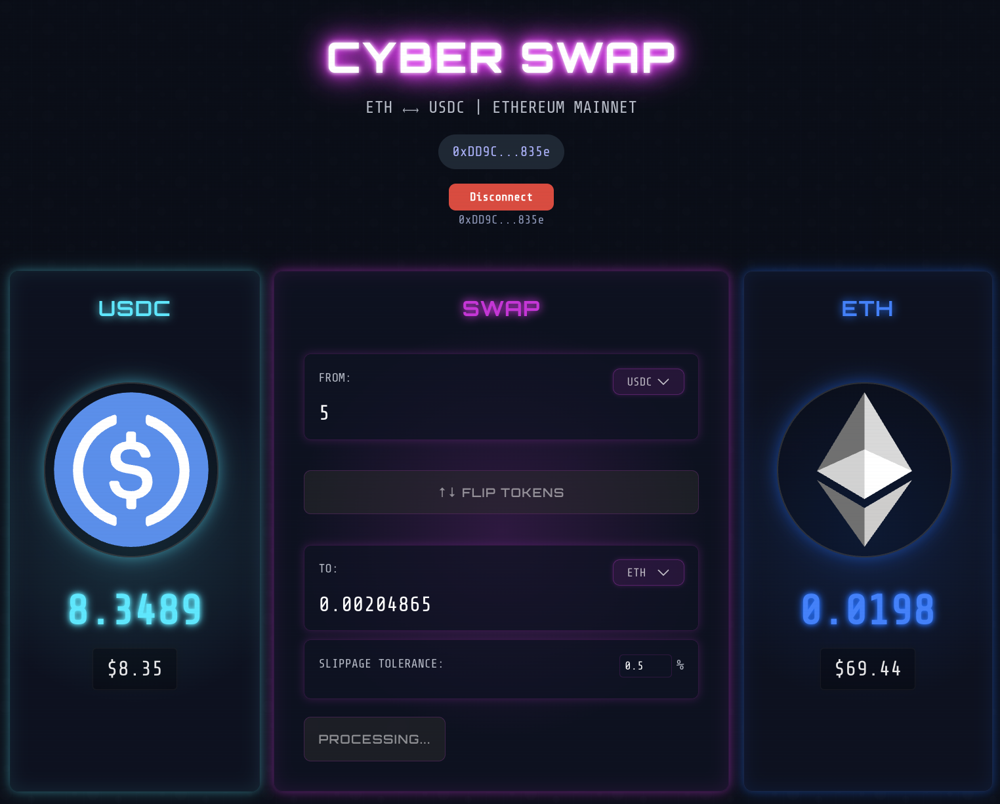

# Cyberpunk Uniswap V3 ETH-USDC Swap Integration




This application demonstrates a implementation of Ethereum token swaps between ETH and USDC using the Uniswap V3 protocol with a cyberpunk-themed UI. The integration handles all aspects of the swap process including trade creation, price quoting, slippage handling, token approval, and transaction execution.

## Transaction Details: ETH to USDC Swap

### Transaction Structure

```javascript
// Actual transaction sent to the network
{
  to: "0xE592427A0AEce92De3Edee1F18E0157C05861564", // Uniswap V3 SwapRouter
  from: "<user-address>",
  value: "<eth-amount-in-wei>", // ETH being swapped
  data: "0x414bf389..." // Encoded function call to exactInputSingle
}
```

### Function Call Encoding

The `data` field encodes a call to `exactInputSingle` with these parameters:

```solidity
ISwapRouter.ExactInputSingleParams({
  tokenIn: 0xC02aaA39b223FE8D0A0e5C4F27eAD9083C756Cc2, // WETH
  tokenOut: 0xA0b86991c6218b36c1d19D4a2e9Eb0cE3606eB48, // USDC
  fee: 500, // 0.05% fee tier
  recipient: "<user-address>",
  deadline: <timestamp>,
  amountIn: "<eth-amount-in-wei>",
  amountOutMinimum: "<min-usdc-with-slippage>",
  sqrtPriceLimitX96: 0 // No price limit
})
```

### Transaction Flow

1. User's ETH is automatically wrapped to WETH by the SwapRouter
2. WETH is swapped for USDC through the 0.05% fee pool
3. USDC is sent directly to the user's wallet

## Transaction Details: USDC to ETH Swap

### Prerequisite: Token Approval (if needed)

```javascript
// Separate transaction if allowance is insufficient
{
  to: "0xA0b86991c6218b36c1d19D4a2e9Eb0cE3606eB48", // USDC contract
  from: "<user-address>",
  data: "0x095ea7b3..." // Encoded approve function call
}
```

Encodes a call to `approve` with:
```solidity
USDC.approve(
  0xE592427A0AEce92De3Edee1F18E0157C05861564, // SwapRouter address
  "<usdc-amount>" or "<max-uint256>" // Amount to approve
)
```

### Main Swap Transaction

```javascript
{
  to: "0xE592427A0AEce92De3Edee1F18E0157C05861564", // Uniswap V3 SwapRouter
  from: "<user-address>",
  data: "0xac9650d8..." // Encoded multicall function with multiple operations
}
```

### Function Call Encoding

The `data` field encodes a call to `multicall` containing:

1. `exactInputSingle` operation:
```solidity
ISwapRouter.ExactInputSingleParams({
  tokenIn: 0xA0b86991c6218b36c1d19D4a2e9Eb0cE3606eB48, // USDC
  tokenOut: 0xC02aaA39b223FE8D0A0e5C4F27eAD9083C756Cc2, // WETH
  fee: 500, // 0.05% fee tier
  recipient: 0xE592427A0AEce92De3Edee1F18E0157C05861564, // SwapRouter itself
  deadline: <timestamp>,
  amountIn: "<usdc-amount>",
  amountOutMinimum: "<min-eth-with-slippage>",
  sqrtPriceLimitX96: 0 // No price limit
})
```

2. `unwrapWETH9` operation:
```solidity
ISwapRouter.unwrapWETH9(
  "<min-eth-with-slippage>", // Amount to unwrap (same as output from swap)
  "<user-address>" // Recipient of unwrapped ETH
)
```

### Transaction Flow

1. USDC is transferred from user to SwapRouter via allowance
2. USDC is swapped for WETH through the 0.05% fee pool
3. WETH stays in the SwapRouter contract temporarily
4. WETH is unwrapped to native ETH
5. Native ETH is sent to the user's wallet

## Smart Contracts Used

This application interacts with several Ethereum smart contracts on mainnet:

### 1. Uniswap V3 SwapRouter (`0xE592427A0AEce92De3Edee1F18E0157C05861564`)

The primary contract for executing swaps on Uniswap V3. This contract provides the following key functions:

- **`exactInputSingle`**: Executes a swap of a specific amount of one token for as much as possible of another token
  - Parameters include: tokenIn, tokenOut, fee, recipient, deadline, amountIn, amountOutMinimum, sqrtPriceLimitX96
  - Used for both ETH→USDC and USDC→WETH swaps

- **`unwrapWETH9`**: Unwraps WETH to native ETH and sends it to a specified recipient
  - Used after USDC→WETH swaps to convert the WETH to native ETH

- **`multicall`**: Allows batching multiple function calls into a single transaction
  - Used to combine USDC→WETH swap and WETH→ETH unwrapping in one transaction

## UI Components

### Token Panels

The application features two token panels for ETH and USDC:

- **Left Panel (ETH)**: Displays the user's ETH balance with neon blue glow effects
- **Right Panel (USDC)**: Displays the user's USDC balance with darker blue glow effects

Each token panel includes:
- Token logo with cyberpunk-styled glow effects
- Current token balance
- USD equivalent value

### Swap Panel

The central swap panel contains:

- Input field for the amount to swap
- "Flip Tokens" button to switch between ETH→USDC and USDC→ETH
- Estimated output display with slippage information
- Swap button with neon pink glow effect
- Transaction status indicators

### Wallet Connection

The application includes a wallet connection component that:

- Prompts users to connect their Ethereum wallet
- Displays the connected account address
- Shows connection status

## Cyberpunk Styling

The UI features a distinctive cyberpunk aesthetic:

- **Color Scheme**: 
  - Neon pink for the swap panel and buttons
  - Neon blue variants for token panels
  - Dark background with subtle grid patterns

- **Typography**:
  - Futuristic fonts (Orbitron, Share Tech Mono)
  - High contrast text with glow effects

- **Visual Effects**:
  - Multi-layered glow effects on all interactive elements
  - Semi-transparent panels with backdrop blur
  - Animated hover states with intensified glow
  - Subtle border highlights

## Development

This application is built using:

- React for the UI components
- ethers.js for Ethereum interactions
- Uniswap V3 SDK for swap calculations
- Custom hooks for wallet connection and token balances

### 2. WETH (Wrapped Ether) Token Contract (`0xC02aaA39b223FE8D0A0e5C4F27eAD9083C756Cc2`)

The canonical ERC20 wrapped version of ETH on Ethereum mainnet.

### 3. USDC Token Contract (`0xA0b86991c6218b36c1d19D4a2e9Eb0cE3606eB48`)

The official USD Coin ERC20 token on Ethereum mainnet.

### 4. Uniswap V3 Pool Contract

The ETH/USDC liquidity pool that facilitates the swap. For the 0.3% fee tier, the pool address is dynamically computed but corresponds to the ETH-USDC pair with the following properties:
- Fee tier: 0.3% (3000 in Uniswap's fee representation)
- Token0: WETH
- Token1: USDC

## How Swaps Are Executed

### ETH to USDC Swap

1. **Trade Creation**:
   - The application first attempts to create a trade using Uniswap V3 SDK by:
     - Fetching on-chain pool data (slot0, liquidity, fee)
     - Creating a Pool instance with the fetched data
     - Constructing a Route with the pool
     - Creating a Trade object with the route
   - If this fails, a fallback mechanism uses a direct swap approach

2. **Transaction Execution**:
   - The `exactInputSingle` function is called on the SwapRouter contract
   - Native ETH is sent along with the transaction (using the `value` field)
   - ETH is automatically wrapped to WETH by the router
   - The router swaps WETH for USDC
   - USDC is sent directly to the user's wallet

### USDC to ETH Swap

1. **Token Approval**:
   - Before swapping, the application checks if the router has sufficient allowance to spend the user's USDC
   - If not, it calls the `approve` function on the USDC contract to grant permission

2. **Multicall Transaction**:
   - A multicall transaction is created that combines two operations:
     - `exactInputSingle`: Swaps USDC for WETH, but sends the WETH to the router itself
     - `unwrapWETH9`: Unwraps the WETH to native ETH and sends it to the user's wallet
   - This approach ensures the user receives native ETH instead of WETH

## Implementation Details

### Slippage Protection

The application implements slippage protection by calculating a minimum output amount based on the user's slippage tolerance setting (defaulting to a minimum of 5% for safety). This ensures trades don't execute if market conditions change unfavorably between quote and execution.

### Error Handling

The integration includes robust error handling for common issues:

- **Quoter Contract Failures**: If the Uniswap Quoter contract call fails (common with some RPC providers), the application falls back to calculating quotes using pool price data
- **STF Errors**: To prevent "SafeTransferFrom" errors, the transaction uses generous gas limits and higher gas prices
- **Transaction Failures**: Detailed error messages are provided to help diagnose issues

### Gas Optimization

For mainnet transactions, the application:
- Sets appropriate gas limits (1,000,000 for simple swaps, 1,500,000 for multicalls)
- Uses a gas price 20% higher than the network average to improve confirmation times
- Batches operations using multicall to reduce overall transaction costs

## Getting Started

### Installation

```bash
npm install
```

### Running the Application

```bash
npm start
```

Open [http://localhost:3000](http://localhost:3000) to view the application in your browser.

### Building for Production

```bash
npm run build
```

## Dependencies

- **@uniswap/v3-sdk**: Core SDK for interacting with Uniswap V3
- **@uniswap/sdk-core**: Base primitives and entities for the Uniswap SDK
- **ethers.js**: Ethereum wallet implementation and utilities
- **React**: Frontend framework
